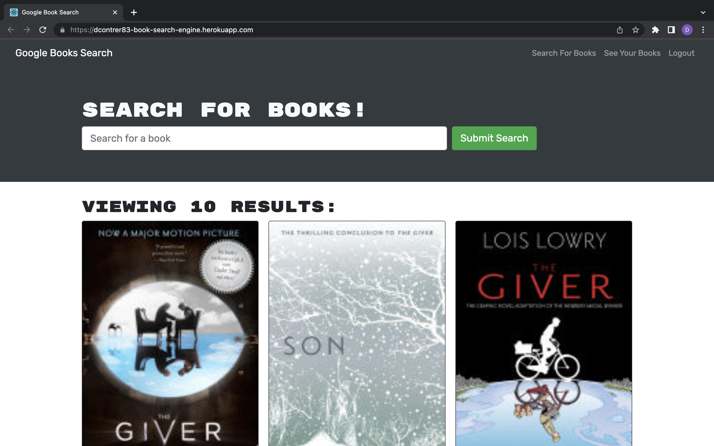
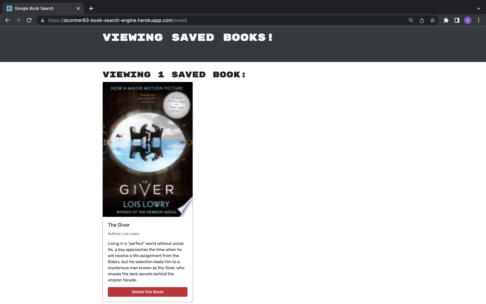

# Book Search Engine

  

  ## Description 
  Fully functioning Google Books API search engine using GraphQL API built with Apollo Server. This application uses MERN stack.

  ## Installation
  install all files from this repo. If you want to open this app locally then `npm install` to install all required packages. Then run `npm run develop`.

  ## Usage
  The user can search up any book in the Google Books API withoug logging in or signing up. Users can sign up or login to keep track books they want to save and be able to later remove books from their list. 

  ## Screenshots
  
  
  

  ## Link
  Link to deployed application: [dcontrer83 book search engine](https://dcontrer83-book-search-engine.herokuapp.com/)

  ## License
  The license that is used for this project is: MIT License

  For more information please go to: https://choosealicense.com/licenses/mit/

  ## Questions
  GitHub Username: dcontrer83

  Link to GitHub profile: [dcontrer83 GitHub Profile](https://github.com/dcontrer83)

  Email Address: dcontrer83@yahoo.com

